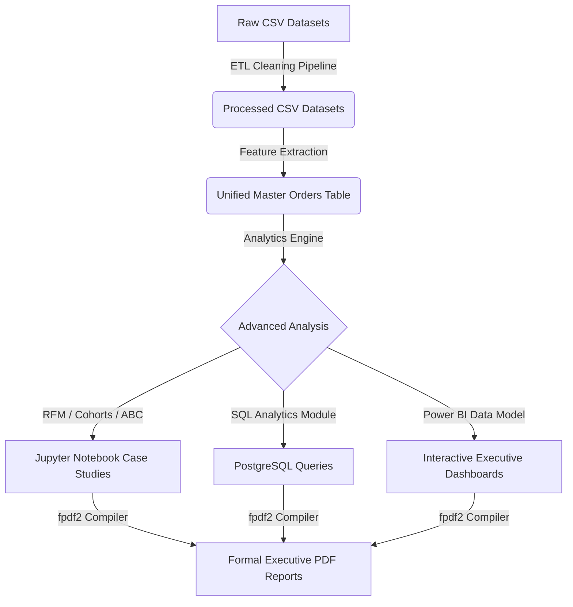
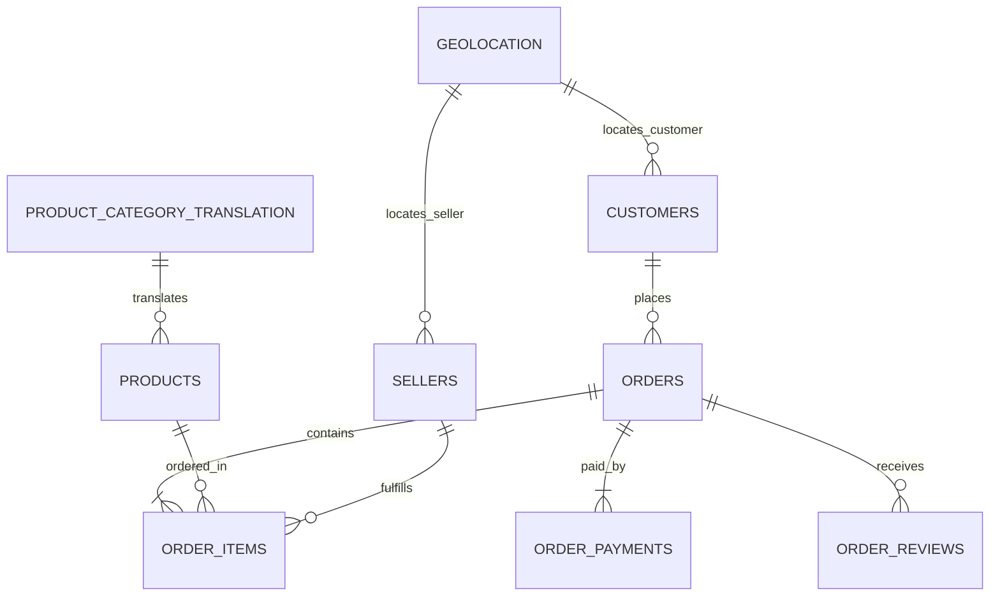

# Olist Brazilian E-Commerce End-to-End Data Analytics Project
### 🇧🇷 A Production-Grade Business & Operational Case Study


---

## 1. Project Overview

This repository hosts a **complete, industry-level data analytics portfolio project** using the Olist Brazilian E-Commerce dataset. The project transitions from a SaaS business background statement to automated Python ETL pipelines, advanced custom analytics (RFM customer segmentations, ABC category pareto checks, and cohort customer retention calculations), PostgreSQL-compatible queries, and DAX-driven Power BI dashboards.

The final reports are compiled into formal PDF executives briefs to present operational recommendations.

---

## 2. Business Problem & Objective

Olist connects Brazilian merchants to national e-commerce channels. Although platform GMV has shown substantial month-over-month growth, scaling logistics and operations has introduced severe frictions:
- **NPS Decay**: High delivery delays directly impact platform search rankings.
- **Transactional Customer Base**: A low repeat-buyer rate increases Customer Acquisition Cost (CAC) pressure.
- **Seller Quality Auditing**: High variation in merchant lead times requires systematic tracking.

### Platform Performance KPIs
- **Gross Merchandise Value (GMV)**: ~15.9M BRL
- **Late Delivery Rate (LDR)**: ~6.6% platform-wide
- **Repeat Purchase Rate (RPR)**: ~3.2% (96.8% one-time buyers)
- **Average Review Rating**: 4.08 / 5.0 (crashes to 2.2 for late orders)

---

## 3. Tech Stack

- **Data Processing**: Python 3.13, Pandas, NumPy
- **Visual Profiling**: Matplotlib, Seaborn, Plotly
- **Database Analysis**: PostgreSQL 15 (compatible with standard syntax)
- **Business Intelligence**: Power BI Desktop (DAX-driven calculations)
- **Report Compilers**: FPDF2 Unicode PDF compiler

---

## 4. Architecture & Workflow

### 4.1 System Workflow


### 4.2 Entity Relationship Diagram (ERD)


---

## 5. Repository Folder Structure

```
.
├── data/
│   ├── raw/               # 9 raw Olist CSV datasets
│   └── processed/         # Cleaned, translated, and master orders datasets
├── notebooks/
│   ├── 01_business_understanding.ipynb
│   ├── 02_data_understanding.ipynb
│   ├── 03_data_cleaning.ipynb
│   ├── 04_feature_engineering.ipynb
│   ├── 05_exploratory_data_analysis.ipynb
│   ├── 06_business_analysis.ipynb
│   └── final_analytics_masterclass.ipynb  # Consolidated master study
├── sql/
│   ├── 01_data_exploration.sql
│   ├── 02_customer_analysis.sql
│   ├── 03_sales_analysis.sql
│   ├── 04_product_analysis.sql
│   ├── 05_seller_analysis.sql
│   ├── 06_delivery_analysis.sql
│   ├── 07_reviews_analysis.sql
│   └── 08_advanced_queries.sql
├── dashboard/
│   ├── dax_measures.md        # Complete list of DAX measures
│   └── dashboard_design_guide.md # Page-by-page dashboard layout blueprints
├── reports/
│   ├── Executive_Report.pdf
│   ├── Data_Dictionary.pdf
│   ├── Business_Insights.pdf
│   └── Dashboard_Guide.pdf
├── src/
│   ├── cleaning.py            # Clean functions module
│   ├── features.py            # Feature engineering modules
│   ├── analytics.py           # RFM, ABC, and scorecards math
│   ├── run_cleaning_pipeline.py
│   ├── run_feature_pipeline.py
│   └── generate_pdfs.py       # Converts Markdown files to PDF
├── requirements.txt
└── README.md
```

---

## 6. Business Insights & Recommendations

1. **Southeast Corridor Centering**: Set up dedicated fulfillment centers (Olist Envios) in the São Paulo metro area. São Paulo alone contributes **37%** of revenue. Storing Class A listings locally will reduce delivery times from 10.2 days down to 2 days for the main Southeast corridor.
2. **Implement Seller Quality Compliance SLAs**: Since **37%** of negative customer feedback (1-2 stars) is caused by late deliveries, enforce the Seller Performance Scorecard. Demote listings of merchants with scores below 50 until their late fulfillment rates drop under 5%.
3. **CRM Loyalty Programs**: To improve the 3.2% Repeat Purchase Rate, automate post-delivery email triggers offering a 10% coupon valid for 30 days.
4. **Interest-Free Installments**: Partner with card processors to offer up to 6 interest-free installments for Class A listings. Customers buying with installments have higher Average Order Values (AOV).
5. **Dynamic Estimated Delivery Dates**: Implement state-level logistics matrices to provide realistic shipping forecasts. This reduces customer anxiety and chargeback rates.

---

## 7. Setup & Installation Guide

### Prerequisites
- Python 3.10+
- Power BI Desktop (for visualization)

### Steps

1. **Clone the repository**:
   ```bash
   git clone https://github.com/yourusername/olist-data-analytics.git
   cd olist-data-analytics
   ```

2. **Install dependencies**:
   ```bash
   pip install -r requirements.txt
   ```

3. **Run the Data Pipeline**:
   Execute the ETL pipelines to clean, engineer, and output the master dataset:
   ```bash
   python src/run_cleaning_pipeline.py
   python src/run_feature_pipeline.py
   ```

4. **Compile PDF Reports**:
   Regenerate the executive report PDFs:
   ```bash
   python src/generate_pdfs.py
   ```

5. **SQL & Power BI**:
   - The SQL scripts under `sql/` can be executed directly in PgAdmin or DBeaver.
   - Load the processed CSVs under `data/processed/` into Power BI Desktop and deploy using the blueprint in the [dashboard guide](dashboard/dashboard_design_guide.md).
