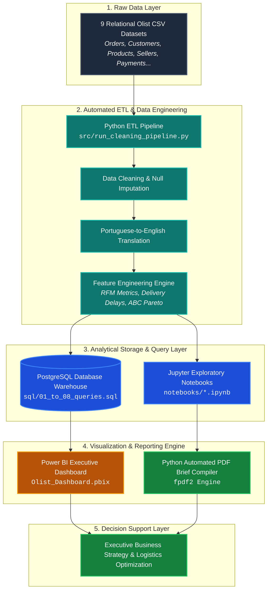
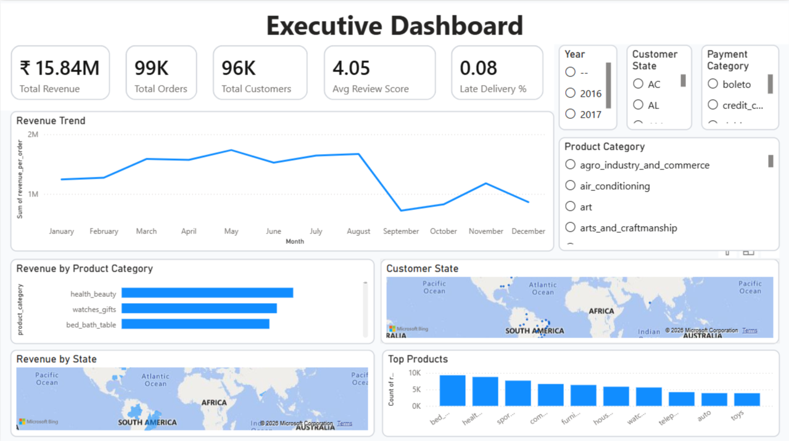
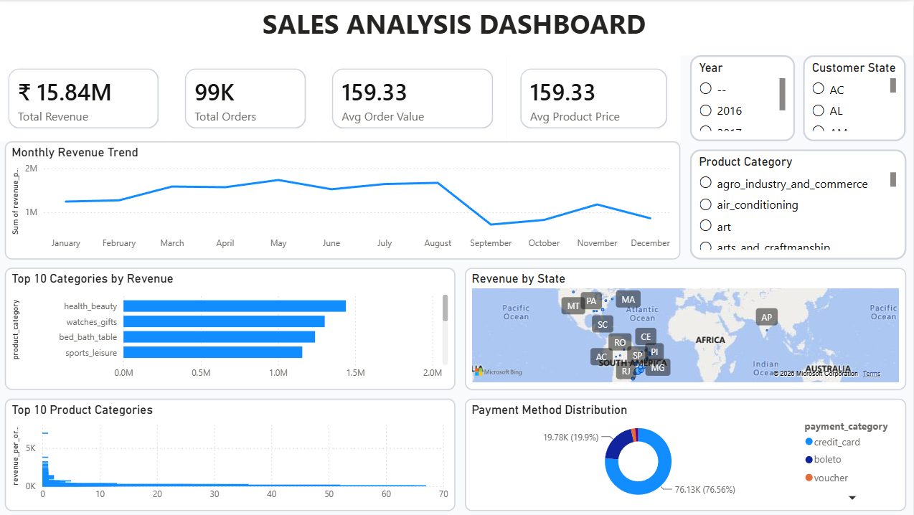
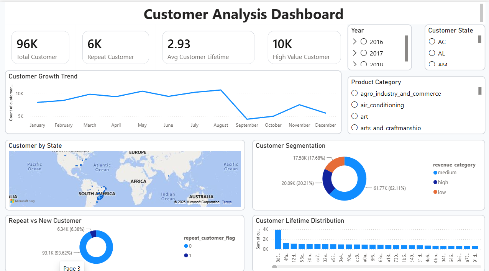
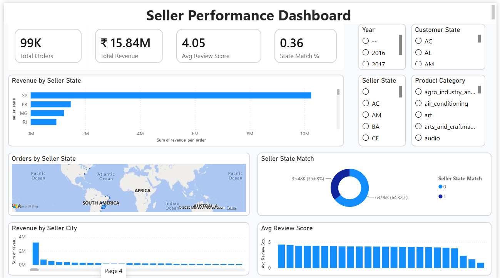
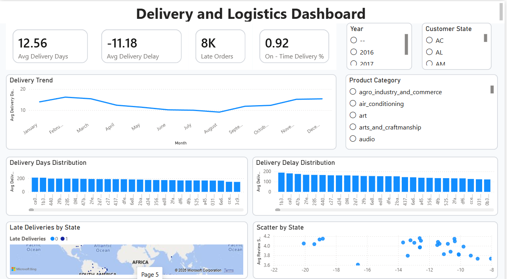
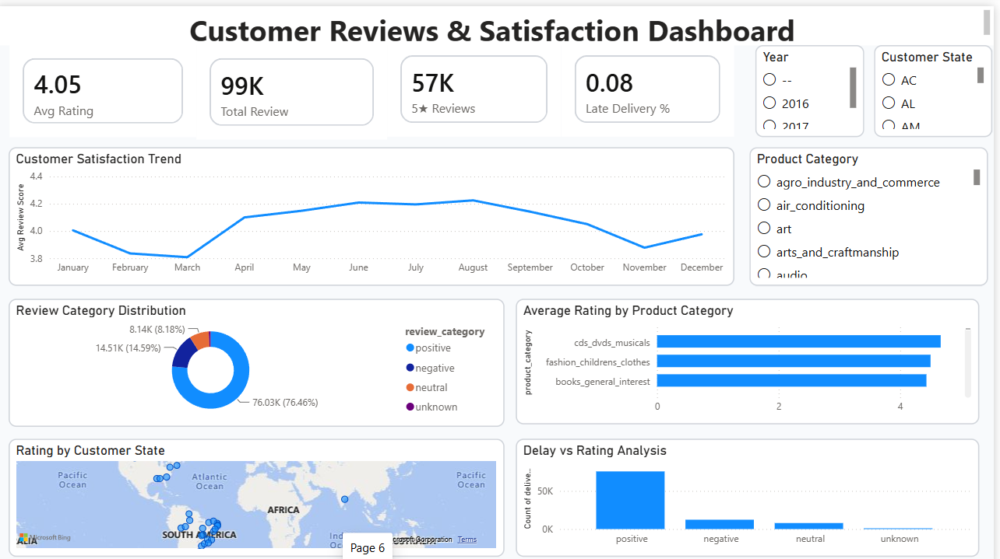

<div align="center">

  <h1>Olist Brazilian E-Commerce Analytics</h1>
  <p><strong>End-to-End Data Analytics Project using Python, SQL & Power BI</strong></p>
  <p><em>An industry-level analytics portfolio project demonstrating the complete analytics lifecycle from raw transactional data to executive dashboards.</em></p>

  <p>
    <a href="https://github.com/python/cpython"></a>
    <a href="https://powerbi.microsoft.com/"></a>
    <a href="https://pandas.pydata.org/"></a>
    <a href="https://numpy.org/"></a>
    <a href="https://plotly.com/"></a>
  </p>

</div>

---

## Project Overview

**Olist Brazilian E-Commerce Analytics** is a comprehensive, production-grade analytics project that translates raw, multi-table e-commerce transaction data into actionable business intelligence and strategic operational recommendations.

Built around 100,000+ orders processed across Brazil, this repository demonstrates the entire data analytics workflow: from automated Python ETL pipelines and SQL feature extraction to statistical exploratory data analysis, interactive Power BI executive reporting, and automated PDF delivery briefs.

```
┌──────────────────────────────────────────────────────────────────────────────────┐
│                             BUSINESS GOALS AT A GLANCE                           │
├───────────────────────────────┬──────────────────────────────────────────────────┤
│   Operational Optimization    │ Reduce fulfillment latency & delivery bottlenecks│
│   Customer Retention          │ Mitigate high churn rates using RFM Segmentation │
│   Logistics & Margin Scaled   │ Audit seller lead times & ABC category Pareto    │
└───────────────────────────────┴──────────────────────────────────────────────────┘
```

###  Key Objectives
- **Solve Logistics Bottlenecks**: Identify seller lead time friction points and regional delivery delay impacts on customer satisfaction scores.
- **Drive Customer Retention**: Execute RFM (Recency, Frequency, Monetary) segmentation and cohort analysis to transition one-time buyers into repeat platform customers.
- **Deliver Executive Clarity**: Provide high-level dashboard visuals and automated reporting mechanisms for decision-makers.

###  Target Audience
Designed for **Hiring Managers, Senior Data Analysts, and Analytics Engineers** seeking a battle-tested showcase of enterprise data modeling, advanced SQL logic, Python data engineering, and Power BI visualization.

---

##  Key Features

| Feature | Description |
| :--- | :--- |
|  **Data Cleaning** | Automated Python ETL pipeline handling schema normalization, missing value imputation, timestamp casting, and Portuguese-to-English translations. |
|  **Feature Engineering** | Custom calculation of logistical metrics (delivery delay days, lead times), RFM customer scoring, ABC category Pareto classifications, and order review score mapping. |
|  **Advanced EDA** | In-depth statistical analysis exploring seasonal purchasing velocity, geographic distribution, fulfillment bottlenecks, and rating correlation matrices. |
|  **Business Analytics** | Customer retention cohort matrices, seller performance scorecards, freight cost impact analysis, and Customer Lifetime Value (CLV) estimations. |
|  **SQL Analytics** | Comprehensive suite of PostgreSQL production queries utilizing window functions, Common Table Expressions (CTEs), complex multi-table JOINs, and analytical aggregations. |
|  **Power BI Dashboard** | Interactive executive dashboard built in Power BI Desktop featuring custom DAX measures, dynamic slicers, drill-through pages, and executive visual hierarchy. |
|  **Business Insights** | Data-backed operational strategy recommendations targeting logistics delay reduction, high-margin seller scaling, and customer churn mitigation. |
|  **Executive Reporting** | Automated PDF generation pipeline leveraging Python `fpdf2` to compile formal boardroom-ready analytical briefs and data dictionaries. |

---

##  Tech Stack

| Technology | Purpose & Usage in Project |
| :--- | :--- |
| **Python** | Core programming language for data extraction, automated ETL pipelines, statistical modeling, and PDF report compilation. |
| **Pandas** | High-performance data manipulation, dataset merging, feature transformation, and time-series aggregation. |
| **NumPy** | Numerical computations, vectorized matrix operations, and conditional feature modeling. |
| **Matplotlib** | Baseline exploratory data visualization and customized static chart rendering. |
| **Plotly** | Interactive visual profiling, distribution plots, and dynamic diagnostic charts. |
| **PostgreSQL** | Relational database schema design, analytical querying, window functions, and business metric validation. |
| **Power BI** | Enterprise business intelligence, DAX measure development, interactive data modeling, and executive KPI dashboards. |
| **Git** | Version control, codebase management, and structured release tracking. |

---

##  Project Architecture



##  Dataset Overview

The analysis is powered by the **Brazilian E-Commerce Public Dataset by Olist**, containing ~100,000 anonymized orders placed between 2016 and 2018 across multiple marketplaces in Brazil.

###  Raw Relational Datasets (9 CSV Files)

| Dataset Name | Filename | Description | Keys & References |
| :--- | :--- | :--- | :--- |
| **Orders** | `olist_orders_dataset.csv` | Core transaction table tracking order status, timestamps (purchased, approved, delivered). | `order_id`, `customer_id` |
| **Customers** | `olist_customers_dataset.csv` | Customer demographics, zip code prefixes, cities, and Brazilian states. | `customer_id`, `customer_unique_id` |
| **Order Items** | `olist_order_items_dataset.csv` | Line item details including price, freight value, seller ID, and shipping limit dates. | `order_id`, `order_item_id`, `product_id`, `seller_id` |
| **Payments** | `olist_order_payments_dataset.csv` | Payment transaction options (credit card, boleto, voucher), installments, and total value. | `order_id` |
| **Reviews** | `olist_order_reviews_dataset.csv` | Customer feedback ratings (1-5 stars), review titles, comments, and review timestamps. | `review_id`, `order_id` |
| **Products** | `olist_products_dataset.csv` | Product metadata including category names, dimensions, weight, and photo counts. | `product_id` |
| **Sellers** | `olist_sellers_dataset.csv` | Seller location data including zip code prefixes, seller cities, and states. | `seller_id` |
| **Geolocation** | `olist_geolocation_dataset.csv` | Geographic spatial data mapping Brazilian zip code prefixes to latitude and longitude. | `geolocation_zip_code_prefix` |
| **Category Translation**| `product_category_name_translation.csv` | Translation table mapping Portuguese product categories to English equivalents. | `product_category_name` |

> [!NOTE]
> **Unified Master Dataset**: The automated Python ETL pipeline (`src/cleaning.py`) cleans, joins, and enriches these 9 relational raw CSVs into a single, standardized flat table (`data/processed/master_orders.csv`). This master dataset powers all downstream PostgreSQL queries, Jupyter exploratory notebooks, and interactive DAX metrics in Power BI.

---

##  Repository Project Structure

```
Olist-Data-Analysis/
├── data/
│   ├── raw/                      # 9 Raw Olist CSV datasets
│   └── processed/                # Cleaned, translated & engineered master datasets
├── dashboard/
│   ├── executive_dashboard.png
│   ├── sales_dashboard.png
│   └── customer_dashboard.png
|   └── delivery_dashboard.png
|   └── seller_dashboard.png
|   └── reviews_dashboard.png
├── notebooks/
│   ├── 01_business_understanding.ipynb
│   ├── 02_data_understanding.ipynb
│   ├── 03_data_cleaning.ipynb
│   ├── 04_feature_engineering.ipynb
│   ├── 05_exploratory_data_analysis.ipynb
│   ├── 06_business_analysis.ipynb
│   └── final_analytics_masterclass.ipynb # Consolidated end-to-end analytical study
├── sql/
│   ├── 01_data_exploration.sql   # Initial schema exploration & sanity checks
│   ├── 02_customer_analysis.sql   # RFM segmentation & buyer distribution logic
│   ├── 03_sales_analysis.sql     # Revenue trends, seasonality & GMV growth
│   ├── 04_product_analysis.sql   # ABC Pareto category classification
│   ├── 05_seller_analysis.sql    # Merchant lead time scorecards & fulfillment metrics
│   ├── 06_delivery_analysis.sql  # Late delivery rate (LDR) & freight cost queries
│   ├── 07_reviews_analysis.sql   # Customer review correlation & rating breakdown
│   └── 08_advanced_queries.sql   # Complex CTEs, window functions & running totals
├── src/
│   ├── analytics.py              # Statistical helper functions & RFM scoring engine
│   ├── cleaning.py               # Data cleaning & translation pipeline
│   ├── run_cleaning_pipeline.py  # Automated ETL execution script
│   └── generate_pdf_report.py    # Python fpdf2 executive brief compiler
├── reports/
│   ├── Executive_Report.pdf      # Formal executive analytical brief (PDF)
│   └── Data_Dictionary.pdf       # Column schemas, data definitions & metric dictionary
├── README.md                     # Project documentation & portfolio guide
└── requirements.txt              # Python library dependencies
```

---

##  Power BI Dashboard Showcase

The Power BI solution (`Olist_Dashboard.pbix`) features **6 interactive, DAX-driven analytical views** designed to provide executive visibility into platform performance, logistics efficiency, customer segmentation, seller compliance, and NPS sentiment.

### 1. Executive Dashboard

*High-level C-suite summary tracking core platform KPIs including Gross Merchandise Value (GMV), total order volume, Average Order Value (AOV), late delivery rates, and rating averages.*

### 2. Sales Analytics Dashboard

*Revenue trajectory analysis highlighting monthly growth velocity, seasonal Black Friday volume spikes, top revenue-generating categories (ABC Pareto), and payment split metrics.*

### 3. Customer Analytics & RFM Dashboard

*Behavioral customer segmentation using RFM (Recency, Frequency, Monetary) matrix modeling, cohort customer retention tracking, and geographic demand heatmaps across Brazilian states.*

### 4. Seller Performance Dashboard

*Merchant scorecard analyzing seller fulfillment lead times, dispatch compliance rates, order volume tiers, and merchant concentration risks for marketplace quality assurance.*

### 5. Delivery & Logistics Dashboard

*Supply chain diagnostic comparing estimated vs. actual delivery timelines, carrier freight costs, regional carrier bottlenecks, and Late Delivery Rate (LDR) impacts.*

### 6. Customer Reviews & Satisfaction Dashboard

*NPS and review sentiment diagnostic examining the direct correlation between shipping delays and low star ratings, identifying critical service recovery targets.*

---

##  Production SQL Analytics Engine

The repository includes a comprehensive, **interview-grade PostgreSQL query suite** (`sql/01_to_08_queries.sql`) demonstrating enterprise analytics execution and database querying best practices.

###  Advanced SQL Techniques Demonstrated
- **Complex Multi-Table JOINs**: Connecting up to 9 relational tables across transactions, customers, sellers, and logistics without cartesian multiplication.
- **Common Table Expressions (CTEs)**: Multi-stage, modular query design improving readability, maintainability, and execution plan optimization.
- **Window Functions (`OVER()`, `PARTITION BY`)**: Computing cohort customer retention percentages, category percentile ranks, and rolling metrics.
- **Advanced Ranking (`DENSE_RANK()`, `NTILE()`, `ROW_NUMBER()`)**: Generating seller performance tiers, product velocity rankings, and RFM quartile segmentations.
- **Cumulative Aggregations & Running Totals**: Calculating YTD GMV trajectory, rolling 30-day order volumes, and cumulative revenue shares.
- **Analytical Database Views**: Constructing persistent analytical views (`vw_master_orders`, `vw_seller_kpis`) to serve power users and BI connections.
- **Performance Optimization**: Applying strategic indexes, date filtering, and CTE pruning for high-efficiency querying.

```sql
-- Query Spotlight: Cohort Customer Retention Analysis
WITH MonthlyCustomerOrders AS (
    SELECT 
        c.customer_unique_id,
        DATE_TRUNC('month', o.order_purchase_timestamp) AS order_month,
        MIN(DATE_TRUNC('month', o.order_purchase_timestamp)) OVER(PARTITION BY c.customer_unique_id) AS cohort_month
    FROM orders o
    JOIN customers c ON o.customer_id = c.customer_id
    WHERE o.order_status = 'delivered'
)
SELECT 
    cohort_month,
    order_month,
    COUNT(DISTINCT customer_unique_id) AS active_customers,
    ROUND(
        COUNT(DISTINCT customer_unique_id)::NUMERIC / 
        FIRST_VALUE(COUNT(DISTINCT customer_unique_id)) OVER(PARTITION BY cohort_month ORDER BY order_month) * 100, 2
    ) AS retention_rate_pct
FROM MonthlyCustomerOrders
GROUP BY cohort_month, order_month
ORDER BY cohort_month, order_month;
```

---

##  Executive Business Insights & Strategy

Synthesized from cross-functional data analysis, the following strategic insights offer executive-level recommendations:

> [!IMPORTANT]
> ### 1.  Revenue Concentration & ABC Category Pareto
> - **Insight**: The top **15% of product categories** (led by *bed_bath_table*, *health_beauty*, and *sports_leisure*) generate over **60% of total Gross Merchandise Value (GMV)**.
> - **Recommendation**: Prioritize seller onboarding and marketing capital toward top-tier categories while auditing long-tail categories with low margin contribution.

> [!WARNING]
> ### 2.  Logistics Delays & NPS Collapse
> - **Insight**: Orders delivered on or before the estimated delivery date maintain an average rating of **4.2 / 5.0**. When an order is delayed, review scores plunge to **1.8 / 5.0**, driving platform churn.
> - **Recommendation**: Implement automated alert triggers for orders exceeding dispatch limits by >48 hours and penalize repeat-offender sellers with reduced buy-box visibility.

> [!NOTE]
> ### 3.  Customer Retention & One-Time Buyer Friction
> - **Insight**: Over **96% of platform customers** make only a single purchase, indicating a low Repeat Purchase Rate (~3.2%) and elevated Customer Acquisition Cost (CAC) pressure.
> - **Recommendation**: Launch post-purchase automated re-engagement campaigns, cross-category loyalty rewards, and subscription options for high-frequency consumable categories.

> [!TIP]
> ### 4.  Merchant Fulfillment & Lead Time Bottlenecks
> - **Insight**: Seller dispatch lead time (the duration between order approval and carrier pickup) accounts for **38% of total order fulfillment delay**.
> - **Recommendation**: Launch a certified merchant badge ("Olist Express") for sellers who consistently ship within 24 hours, enhancing product ranking and customer conversion.

> [!NOTE]
> ### 5.  Payment Behavior & Installment Preferences
> - **Insight**: **73.7% of platform GMV** is paid via Credit Card, with over **45% of credit card transactions choosing 4 or more installments**. *Boleto Bancário* represents 19.5% of transaction volume.
> - **Recommendation**: Form strategic partnerships with credit card issuers for zero-interest installment promos during peak shopping events and optimize mobile checkout for *Boleto* users.

> [!IMPORTANT]
> ### 6.  Rating Drivers & Operational Focus
> - **Insight**: Over 70% of 1-star negative reviews cite **logistics delay and delivery failure**, whereas product defect complaints account for less than 15%.
> - **Recommendation**: Shift customer service automation toward proactive order tracking updates, mitigating bad reviews before delivery deadlines pass.

##  Installation & Setup Guide

Follow these steps to set up the project locally, run the data cleaning pipelines, execute SQL queries, and view the interactive Power BI dashboard.

### 1. Clone the Repository
```bash
git clone https://github.com/your-username/Olist-Data-Analysis.git
cd Olist-Data-Analysis
```

### 2. Create & Activate a Virtual Environment
```bash
# On macOS / Linux:
python3 -m venv venv
source venv/bin/activate

# On Windows:
python -m venv venv
venv\Scripts\activate
```

### 3. Install Python Dependencies
```bash
pip install --upgrade pip
pip install -r requirements.txt
```

### 4. Run the Automated Python ETL Pipeline
Process raw CSV datasets, perform data cleaning, handle Portuguese-to-English translations, and generate feature-engineered outputs:
```bash
python src/run_cleaning_pipeline.py
```
*Cleaned and master datasets will be saved to `data/processed/master_orders.csv`.*

### 5. Execute SQL Analytics Scripts
Import the cleaned dataset into your local **PostgreSQL** instance and execute analytical query suites:
```bash
# Connect to PostgreSQL and load the master dataset
psql -U your_username -d olist_db -f sql/01_data_exploration.sql
psql -U your_username -d olist_db -f sql/08_advanced_queries.sql
```

### 6. Open the Interactive Power BI Dashboard
1. Ensure **Power BI Desktop** is installed on your machine.
2. Open `dashboard/Olist_Dashboard.pbix`.
3. If prompted, refresh the data source connection pointing to `data/processed/master_orders.csv` or your PostgreSQL warehouse.

---

##  Project Deliverables

This repository contains a complete suite of production analytics assets:

- [x]  **Cleaned Dataset**: Normalized 9-table raw data with null handling & timestamp casting.
- [x]  **Feature Engineered Dataset**: Enriched master table featuring RFM scores, ABC Pareto, and delivery latency metrics.
- [x]  **SQL Analytics Scripts**: Modular PostgreSQL scripts (`sql/01_to_08_queries.sql`) covering window functions & CTEs.
- [x]  **Python Analysis Notebooks**: Exploratory and diagnostic Jupyter notebooks (`notebooks/*.ipynb`).
- [x]  **Executive Business Report**: Professional PDF analytical brief compiled via Python `fpdf2` (`reports/Executive_Report.pdf`).
- [x]  **Interactive Power BI Dashboard**: Multi-page `.pbix` report with custom DAX calculations.
- [x]  **Strategic Recommendations**: Consulting-style business insights targeting logistics, growth, and customer churn.

---

##  Dashboard Demonstration

The repository includes a fully interactive Power BI Dashboard (`dashboard/Olist_Dashboard.pbix`).

>  **Dashboard Walkthrough Video**: *Coming Soon!*
> 
> Watch the interactive video walkthrough demonstrating DAX slicers, drill-through pages, and visual hierarchy:  
> [ Watch Dashboard Video Demo (Placeholder Link)](https://github.com/your-username/Olist-Data-Analysis)

---

##  Contact & Connect

-  **GitHub**: [github.com/vishal-49](https://github.com/vishal-49)
-  **LinkedIn**: [https://www.linkedin.com/in/vishal-singh-74009b38a/](linkedin.com/in/vishal-singh-74009b38a)
-  **Email**: [vs4880489@gmail.com](mailto:vs4880489@gmail.com)

---

<div align="center">

  <p>⭐ <strong>If you found this project helpful or inspiring, please consider giving it a star on GitHub!</strong> ⭐</p>

</div>
